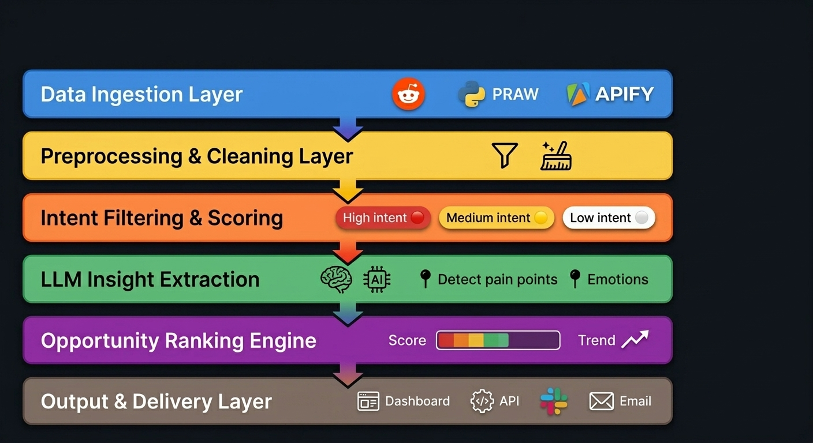

# Reddit Deep Marketing Intelligence System
## Architecture & Implementation Proposal

---

##  1. Objective

Build an automated system that continuously:

- Collects Reddit discussions from targeted subreddits
- Identifies high-intent user pain points
- Filters noise and low-signal content
- Extracts structured market insights
- Ranks opportunities by business value
- Outputs actionable marketing intelligence (feeds, dashboards)

---

##  2. System Architecture

The system is composed of **5 modular layers**:



---

##  3. System Components

---

### 3.1 Data Ingestion Layer

**Purpose:** Collect Reddit content.

**Inputs:**
- Subreddits (e.g. `startups`, `SaaS`, `dataengineering`)
- Keyword queries (expansion layer)

**Methods:**
- Reddit API (PRAW)
<!-- - Optional scraping (Apify) -->

**Output Schema:**
```json
{
  "post_id": "...",
  "title": "...",
  "text": "...",
  "subreddit": "...",
  "url": "...",
  "timestamp": "..."
}
```

---

### 3.2 Preprocessing & Cleaning Layer

**Purpose:** Normalize and prepare data for LLM processing.

**Tasks:**
- Remove duplicates
- Strip HTML / markdown noise
- Language detection *(optional)*
- Filter extremely short posts
- Thread reconstruction (post + top comments)

**Output:** Clean, structured text documents ready for analysis.

---

###  3.3 Intent Filtering & Scoring Layer *(Critical)*

**Purpose:** Filter noise and detect high-intent signals using an LLM-based classifier (Claude / GPT / fine-tuned prompt system).

**Intent Categories:**

| Level | Signal Type |
|-------|-------------|
| 🔴 High Intent | Urgent problems, switching behavior |
| 🟡 Medium Intent | Exploration, comparison |
| ⚪ Low Intent | General discussion, opinion, memes |

**Output Schema:**
```json
{
  "intent_score": "0–100",
  "intent_type": "frustration | switching | discovery | complaint",
  "confidence": "0–1",
  "reason": "short explanation grounded in text"
}
```

---

###  3.4 LLM Insight Extraction Layer

**Purpose:** Convert raw Reddit posts into structured business insights.

**LLM Tasks:**

| Field | Description |
|-------|-------------|
| `pain_point` | Core problem the user faces |
| `user_context` | Who the user is |
| `current_workaround` | How they solve it today |
| `desired_solution` | What they actually want |
| `emotional_tone` | Emotional signal in the post |
| `urgency_level` | How urgently they need a solution |

**Output Schema:**
```json
{
  "pain_point": "Users struggle with tracking SaaS subscriptions manually",
  "context": "Freelancers managing multiple tools",
  "current_solution": "Spreadsheets / manual tracking",
  "desired_solution": "Automated tracking system",
  "emotion": "frustration",
  "urgency": "high"
}
```

---

### 3.5 Opportunity Ranking & Aggregation Layer

**Purpose:** Convert insights into ranked business opportunities.

**Scoring Dimensions:**
- Market demand strength
- Frequency of similar posts
- Urgency level
- Monetization potential
- Competitive saturation *(optional)*

**Output Schema:**
```json
{
  "opportunity_score": "0–100",
  "category": "automation | productivity | devtools",
  "summary": "Growing frustration with manual SaaS tracking among freelancers",
  "trend_strength": "increasing",
  "recommended_angle": "Build subscription tracking automation tool"
}
```

---

### 3.6 Output

**Output Types:**

1. **Insight Feed** — Reddit link, pain point, score, opportunity
2. **Marketing Hook Generator** — LinkedIn hook, ad copy angle, product positioning suggestion

---


## 4. Technology Stack

| Layer | Technology |
|-------|------------|
| Core backend | Python |
| API layer | FastAPI |
| Reddit ingestion | PRAW / Apify |
| LLM layer | Claude / Gemini
| Data storage | PostgreSQL |
| Caching | Redis |
| Vector store | weaviate |
| Scheduling | Airflow |
| Dashboard | Streamlit |

---

## 5. Key Risks & Mitigation

| Risk | Mitigation |
|------|------------|
| Noisy outputs | Strict intent filtering + scoring thresholds |
| Hallucinated insights | Evidence-grounded extraction prompts |
| Inconsistent quality | Evaluation framework + feedback loop |
| Over-reliance on LLM | Hybrid rules + LLM approach |

